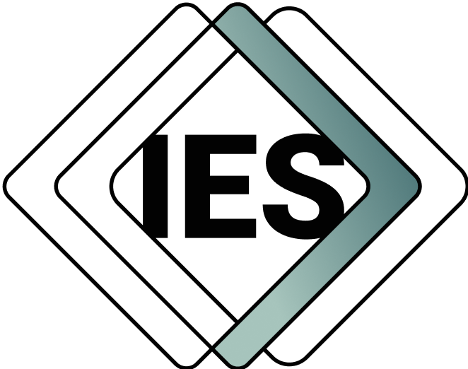

© Crown copyright (2020-2025)

# What is IES?

**A unified approach for seamless data exchange**

The Information Exchange Standard (IES) is an open, structured framework designed to enable consistent and interoperable data exchange across multiple sectors, including buildings, infrastructure (currently encompassing aspects of transport water and energy), defence and national security.

IES provides a common ontology for describing entities, events, relationships, and metadata in a standardised and structured manner. By leveraging semantic web principles (RDF, BORO methodology), IES ensures that data is not only well-defined but also context-aware and machine-readable.

# Why IES matters?

**Standardising data exchange for cross-domain interoperability**

Data fragmentation and inconsistency pose significant challenges to collaboration, analysis, and automation. IES addresses this by:

- Supporting governance and compliance through structured, extensible models
- Providing a shared vocabulary that different systems can interpret
- Facilitating seamless data integration across industries and platforms
- Reducing complexity in information sharing, making processes more efficient and scalable

# Who uses IES?

The IES framework is highly adaptable and is already being adopted across various domains, including:

**Currently, parts of the built environment (including buildings, infrastructure, and utilities), defence, and national security**

- Government & Policy Making – facilitating cross-agency data collaboration
- National Security & Defence – enabling structured intelligence-sharing and situational awareness
- Buildings and infrastructure – enhancing Digital Twins and asset management, and ensuring interoperability across sectors
- Service provision – standardising data for service provision – for example in transport services provision and energy flexibility markets

# How can I get involved?

IES is an evolving and collaborative initiative, welcoming contributions from professionals across diverse sectors. You can:

1. Explore our repositories to gain insight into how IES works in practice
2. Join a domain working group to help shape the standard for your industry
3. Collaborate with organisations to drive adoption and integration across sectors
4. Contribute to the model by proposing improvements, extensions, and refinements

For more information, including contact details, please go to https://www.informationexchangestandard.org

# IES 4.3

If you are new to IES, see the [Introduction to IES][intro] document.

[mit-license]: https://opensource.org/licenses/MIT

## Introduction to 4D Ontologies

For an introduction to 4D Ontologies, see the [Introduction to 4D Ontology][4d-ontology-intro] document.

## IES 4.3 Specification and Documentation

The complete reference for IES 4.3 is available [here][ies.md].

The IES 4.3 technical specification is available in the IES [Specification][specification].

Further supporting documentation is available in [Supporting-Documents][supporting-docs].

Sample data are available in the [Sample-Data][sample-data] directory.

# License

© Crown copyright (2020-2025)

The Information Exchange Standard (IES 4) is licensed under the terms of the [MIT License][mit-license]. Code and data samples are provided under [Open Government Licence](http://www.nationalarchives.gov.uk/doc/open-government-licence/version/3/) except where otherwise stated.

[4d-ontology-intro]: ./v4.3/docs/4dOntologyIntro.md
[ies.md]: ./v4.3/docs/ies.md
[intro]: ./v4.3/docs/introduction.md
[sample-data]: ./v4.3/Sample-Data
[specification]: ./v4.3/Specification
[supporting-docs]: ./v4.3/Supporting-Documents

